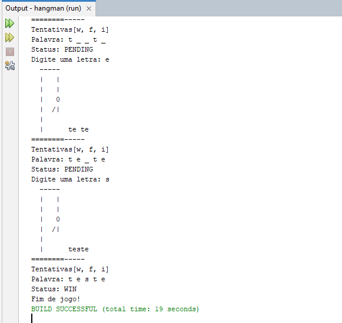

# 🎮 Jogo da Forca em Java

## 📌 Descrição do Desafio
Este programa tem foco no uso de conceitos de **Programação Orientada a Objetos (POO)**.  
Desenvolvido em ambiente console, o jogo inclui a estrutura completa de um jogo tradicional da **forca**, desde a definição da palavra oculta até a montagem gráfica simplificada e a interação com o usuário por meio de menus e entradas de dados.

## 🎯 Conceitos Aplicados
- Conceitos de **classes, objetos, métodos e encapsulamento**;  
- Uso de **listas, enums, exceções personalizadas** e manipulação de **strings**;  
- Desenvolvimento da **lógica de jogo** com controle de estado e interatividade;  
- Prática da **separação de responsabilidades** dentro de um projeto estruturado em Java.  

---

## 🚀 Passos para Executar

Usei a IDE NetBeans e Java 17.
- [Java JDK 17+](https://www.oracle.com/java/technologies/javase-downloads.html)
- [NetBeans IDE](https://netbeans.apache.org/download/index.html)
  
### 📦 Passos para rodar

1. Clone o repositório:
   ```bash
   git clone https://github.com/luizegomes/hangman.git

2. **Abra o projeto no NetBeans:**
   - Vá em `File > Open Project`
   - Selecione a pasta do projeto
    
3. **Configure a palavra do jogo**
    - Clique em `Run` no menu superior
    - Vá em `Set Project Configuration` > `Customize...`
    - Na aba `Run`, no campo `Arguments`, insira a palavra desejada (exemplo: `teste`)
    - Salve e feche a janela
      
4. **Execute o projeto:**
   - Clique com o botão direito no projeto
   - Selecione `Run`

5. **Interaja pelo terminal:**
   - O sistema exibirá o desenho da forca e a quantidade de letras da palavra oculta
   - Digite letras no terminal para tentar adivinhar a palavra
   - O jogo revelará os acertos, marcará os erros no boneco da forca e encerrará quando:
     - Todas as letras forem descobertas (vitória)
     - O limite de erros for atingido (derrota)

---

